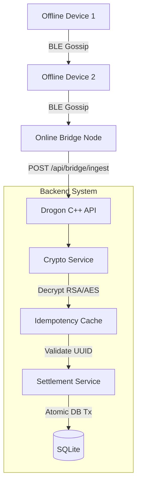

# UPIMesh: Offline-First P2P Payments

> You're in a concrete basement with zero connectivity, but you still need to pay your friend for pizza. UPIMesh proves you can safely sign, encrypt, and pass a digital payment to their phone via Bluetooth (gossip), trusting the network to settle it immutably the second *any* phone in the mesh catches a signal.

## Table of Contents
1. [What this demo proves](#what-this-demo-proves)
2. [How to run it](#how-to-run-it)
3. [The demo flow, step by step](#the-demo-flow-step-by-step)
4. [Architecture](#architecture)
5. [The hard problems and how they're solved](#the-hard-problems-and-how-theyre-solved)
6. [File-by-file walkthrough](#file-by-file-walkthrough)
7. [API Reference](#api-reference)
8. [Tests](#tests)
9. [What's NOT real / what would change for production](#whats-not-real--what-would-change-for-production)
10. [Honest limitations of the concept](#honest-limitations-of-the-concept)
11. [Troubleshooting](#troubleshooting)

## What this demo proves
- **Offline Cryptographic Trust:** A device with zero internet can securely sign and encrypt a payment instruction that only the central bridge can decrypt, using a hybrid RSA-OAEP / AES-256-GCM scheme.
- **Asynchronous Mesh Routing:** Payments can be passed blindly between offline devices (gossiping) until one device finds a connection and uploads the payload.
- **Absolute Idempotency:** The system perfectly rejects replay attacks, duplicate mesh submissions, and stale packets, ensuring double-entry consistency without dropping valid funds.

## How to run it

### Prerequisites
- **CMake** >= 3.20
- **C++20 Compiler** (Clang/GCC/MSVC)
- **OpenSSL** (`brew install openssl` or `apt-get install libssl-dev`)
- **nlohmann/json**
- **SQLite3** (`brew install sqlite` or `apt-get install libsqlite3-dev`)
- **uuid** (`brew install ossp-uuid` or `apt-get install uuid-dev`)
- **Drogon** web framework

### Build & Run (Mac/Linux)
```bash
cd cpp
mkdir build && cd build
cmake ..
make all
./drogonserver
```
Open `http://localhost:8080/` in your browser to view the interactive dashboard. To stop the server, hit `Ctrl+C` in the terminal.

### Running Tests
```bash
cd cpp/build
ctest --output-on-failure
```

## The demo flow, step by step
1. **View Accounts**: Open `http://localhost:8080/`. You see 4 seeded accounts (Alice, Bob, Carol, Dave) with their starting balances.
2. **Send Payment**: In the UI, simulate an offline phone (e.g. Alice's phone) generating a payment to Bob.
   - *Backend*: Generates a UUID nonce, hashes the PIN, constructs a JSON `PaymentInstruction`, encrypts it using the Server's RSA Public Key (Hybrid AES-GCM), and wraps it in a `MeshPacket`.
3. **Gossip Once (Simulate BLE)**: Click the Gossip button.
   - *Backend*: Devices in the mesh exchange packets. Alice's offline packet is handed to a bridge node that has internet access.
4. **Flush to Bridge (Upload)**: Click the Flush button.
   - *Backend*: Online devices POST their cached `MeshPacket`s to `/api/bridge/ingest`. The server decrypts the payload, checks idempotency (rejecting duplicates), deducts Alice's balance, credits Bob's balance, and records a `SETTLED` transaction using SQLite.
5. **View Results**: The Transactions Table updates to show the settled payment, and Alice's balance drops while Bob's rises.

## Architecture



## The hard problems and how they're solved

### 1. Cross-Language Crypto Interop
**The Problem:** This system was originally written in Java (Spring Boot) and ported to C++. We needed to guarantee that a payload encrypted by the legacy Java client could be flawlessly decrypted by the new C++ backend.  
**The Solution:** We enforce a strict byte-level wire format. The C++ `HybridCryptoService` uses raw OpenSSL `EVP` APIs to exactly replicate Java's `Cipher.getInstance("RSA/ECB/OAEPWithSHA-256AndMGF1Padding")` and `AES/GCM/NoPadding`. 

### 2. C++ Memory & Resource Management 
**The Problem:** In Java, the JVM garbage collector cleans up dangling objects and closed connections automatically. In C++, memory leaks and dangling pointers in a long-running web server will cause fatal crashes.  
**The Solution:** The entire service layer relies heavily on `std::shared_ptr` to strictly manage object lifetimes. Drogon handles asynchronous request lifetimes natively, and a Singleton `AppContext` ensures services outlive any given HTTP request without leaking.

### 3. Absolute Single-Writer Serialization
**The Problem:** To prevent race conditions in double-entry accounting (e.g. two concurrent requests trying to spend the same ₹50), we needed strict isolation. The original Java code relied on `ConcurrentHashMap` and JVM thread locks.  
**The Solution:** The C++ `SettlementService` uses a coarse-grained `std::recursive_mutex` combined with an explicit `BEGIN IMMEDIATE TRANSACTION` in SQLite. While this caps system throughput to a single concurrent writer, it completely eliminates race conditions in the demo context.
```cpp
void Database::execute(const char *sql) {
    std::lock_guard<std::recursive_mutex> lock(connectionMutex_);
    // execute sqlite3_exec...
}
```

## File-by-file walkthrough
- `cpp/main.cpp` - Application entry point; initializes services and Drogon HTTP.
- `cpp/CMakeLists.txt` - Build configuration for all libraries and test targets.
- `cpp/controller/ApiController.cpp` - HTTP endpoints mapping directly to backend services.
- `cpp/crypto/` - OpenSSL wrappers (`HybridCryptoService`, `ServerKeyHolder`).
- `cpp/model/` - Core entity structs (`Account`, `Transaction`) and `Database` connection.
- `cpp/service/` - Business logic (`SettlementService`, `IdempotencyService`).
- `cpp/static/index.html` - The vanilla JS offline-mesh simulator dashboard.
- `cpp/*.py`, `cpp/*.sh` - Automated integration and stress tests.

## API Reference

| Method | Path | Purpose |
|--------|------|---------|
| GET | `/api/accounts` | Fetch all user balances |
| GET | `/api/transactions` | Fetch ledger history |
| POST | `/api/demo/send` | Generate & encrypt a payment on a simulated device |
| POST | `/api/mesh/gossip` | Force devices to swap packets |
| POST | `/api/bridge/ingest` | Process a raw encrypted MeshPacket |
| POST | `/api/mesh/reset` | Clear ledger and wipe DB back to seed state |

**Example Request: `POST /api/bridge/ingest`**
```json
{
  "packetId": "uuid-1234",
  "ttl": 5,
  "createdAt": 1784651966402,
  "ciphertext": "base64_encoded_hybrid_payload..."
}
```
**Response:**
```json
{
  "outcome": "SETTLED",
  "transactionId": 42
}
```

## Tests
- `verify_phase1.cpp` - Proves core RSA-OAEP/AES-GCM encryption works in isolation.
- `verify_phase2.cpp` - Proves SQLite models and schema insertion logic.
- `verify_phase3.cpp` - Proves the core service layer (Settlement and Idempotency) works.
- `smoke_test.sh` - Proves basic Drogon HTTP reachability.
- `concurrency_test.sh` - Bombards the server with parallel identical requests to prove the `std::recursive_mutex` rejects all but the first (preventing double spends).
- `read_write_test.py` - End-to-end Python script confirming full UI flow works.
- `pre_ctest_checks.py` - Proves malformed inputs, stale timestamps (>24h), and direct raw `ingest` calls are properly rejected.

## What's NOT real / what would change for production
| Demo Implementation | Production Requirement |
|---------------------|------------------------|
| In-memory `SQLite` database | Persistent `PostgreSQL` cluster with row-level locking |
| `std::recursive_mutex` single-writer lock | DB-level transaction isolation (`SELECT ... FOR UPDATE`) |
| Simulated mesh arrays in RAM | Actual BLE / Wi-Fi Direct multi-hop device SDKs |
| In-memory `std::unordered_set` for idempotency | Distributed cache (Redis) with TTL expirations |
| Cleartext PIN passing in Demo UI | Local hardware Secure Enclave signing |

## Honest limitations of the concept
- **Latency Guarantee:** This is an asynchronous system. A payment is not finalized until the mesh reaches the internet. If you pay someone offline, you are trusting them (or the mesh) to eventually upload it. It is *not* a real-time synchronous payment.
- **Double Spend Window:** If Alice has ₹50 and makes two separate offline payments of ₹50 to Bob and Carol in different physical locations, the *first* one to reach the internet settles. The second fails. The receivers must understand they do not have the money until it settles online.
- **Throughput:** The current C++ mutex implementation is designed for demo safety and correctness, not web-scale throughput.

## Troubleshooting
- **"Address already in use (errno=48)"**: You have a stale `drogonserver` process running in the background. Kill it with `lsof -ti :8080 | xargs kill -9`.
- **404 Not Found on `/`**: Ensure you are launching `./drogonserver` from inside the `build/` directory, so it correctly resolves the relative path to `cpp/static/index.html`.
- **Missing OpenSSL Headers**: If CMake fails to find OpenSSL, specify the root manually: `cmake -DOPENSSL_ROOT_DIR=$(brew --prefix openssl) ..`
